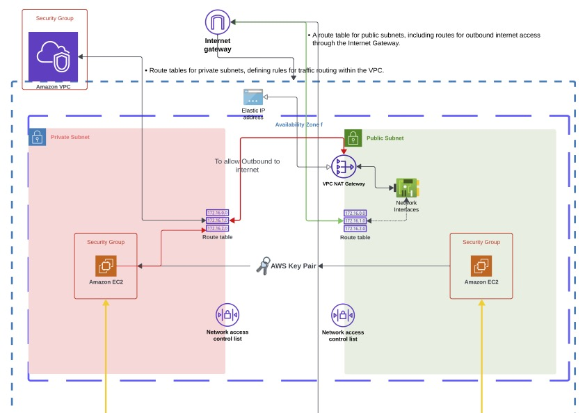

# VPC Topology Documentation

This document outlines the VPC topology for our infrastructure within the AWS account, focusing on the N. Virginia Region which encompasses six availability zones. For each availability zone, we have established one public and one private subnet to ensure a robust and scalable network architecture.

## Prerequisites
- You need AWS programmatic keys or similar permissions to provision this infrastructure.
- A key pair created in the N. Virginia region is required for SSH access. Ensure the key pair name is specified in the code to facilitate testing between hosts using port 22.

## Subnet Details

| S.No | Subnet Type | Availability Zone | CIDR Block       |
|------|-------------|-------------------|------------------|
| 1    | Public      | us-east-1a        | 10.0.0.0/20      |
| 2    | Private     | us-east-1a        | 10.0.16.0/20     |
| 3    | Public      | us-east-1b        | 10.0.32.0/20     |
| 4    | Private     | us-east-1b        | 10.0.48.0/20     |
| 5    | Public      | us-east-1c        | 10.0.64.0/20     |
| 6    | Private     | us-east-1c        | 10.0.80.0/20     |
| 7    | Public      | us-east-1d        | 10.0.96.0/20     |
| 8    | Private     | us-east-1d        | 10.0.112.0/20    |
| 9    | Public      | us-east-1e        | 10.0.128.0/20    |
| 10   | Private     | us-east-1e        | 10.0.144.0/20    |
| 11   | Public      | us-east-1f        | 10.0.160.0/20    |
| 12   | Private     | us-east-1f        | 10.0.176.0/20    |
